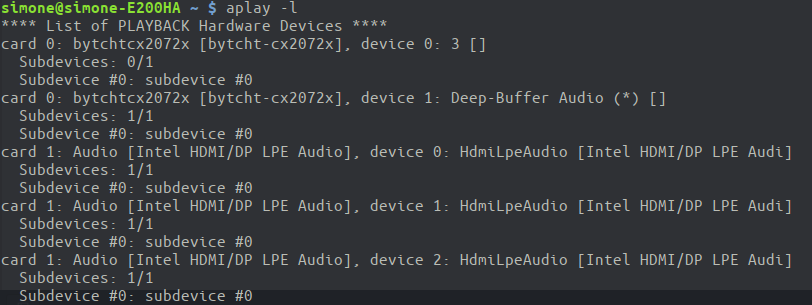

# audio on asus e200ha

i have peppermint 10 and an asus E200HA so first you need first the kernel 5.3 and the extra modules:

```bash
sudo apt-get install linux-headers-5.3.0-26-generic
sudo apt-get install linux-modules-extra-5.3.0-24-generic
```

so next you will have something like

```bash
neofetch
```


```bash
inxi -F
```


```bash
aplay -l
```




so you can see that the audio card is recognized and the driver is `bytcht-cx2072x`.

but the card will not show up in "audio mixer" and in `dmesg`  there is a lot of errors because the driver doesn't have a configuration file.

i found that on another [repo](https://github.com/heikomat/linux/tree/cx2072x/cx2072x_fixes_and_manual) but you only need the `.conf` files, so follow only the fifth point and below:

1. Copy the configuration files for alsa (`bytcht-cx2072x.conf` and `HiFi.conf` from
   the [bytcht-cx2072x folder](https://github.com/heikomat/linux/tree/cx2072x/cx2072x_fixes_and_manual/bytcht-cx2072x))
   to `/usr/share/alsa/ucm/bytcht-cx2072x` (creating the folder first).

   These tell alsa what driver and codec to use, and how to use them

   ```bash
   sudo mkdir --parents /usr/share/alsa/ucm/bytcht-cx2072x
   cd /usr/share/alsa/ucm/bytcht-cx2072x
   sudo wget "https://raw.githubusercontent.com/heikomat/linux/cx2072x/cx2072x_fixes_and_manual/bytcht-cx2072x/HiFi.conf"
   sudo wget "https://raw.githubusercontent.com/heikomat/linux/cx2072x/cx2072x_fixes_and_manual/bytcht-cx2072x/bytcht-cx2072x.conf"
   ```
   
1. Set `realtime-scheduling = no` in `/etc/pulse/daemon.conf` (_see [this issue-comment](https://github.com/Grippentech/Asus-E200HA-Linux-Post-Install-Script/issues/29#issuecomment-355113121)_).

   This makes the pulseaudio daemon not die if the audio device is not found instantly

   **via script**
   ```bash
   sudo sed --in-place --regexp-extended --expression='s/;?\s*realtime-scheduling\s*=\s*(yes|no)/realtime-scheduling = no/g' /etc/pulse/daemon.conf
   ```

   **by hand**
   1. Make sure you edit the file as root, for example with `sudo nano /etc/pulse/daemon.conf`
   1. Change `; realtime-scheduling = yes` to `realtime-scheduling = no`
   1. **make sure you removed the `;` at the beginning of the line, this is important!**
   
1. Reboot

   

credits to [heikomat](https://github.com/heikomat) for the `.conf`